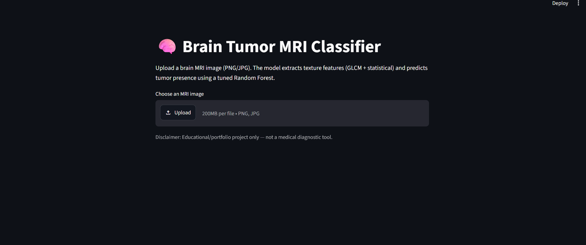
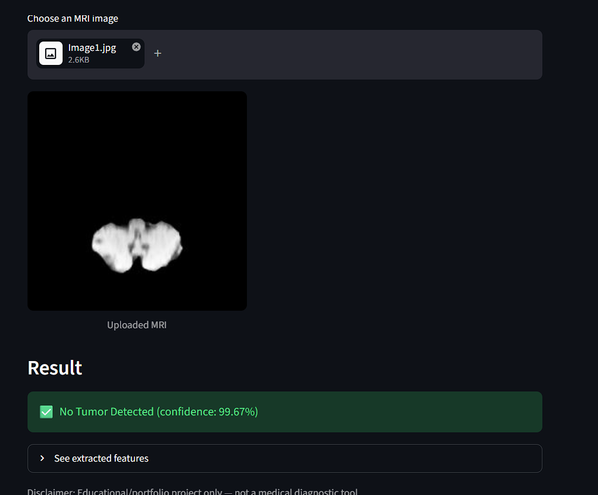
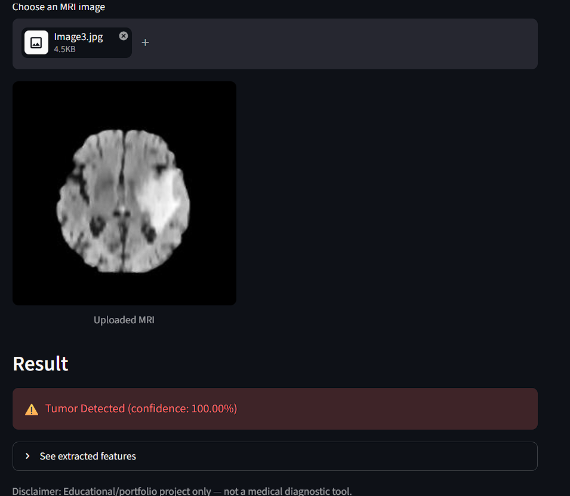

# 🧠 Brain Tumor MRI Classification using Random Forest & Explainable AI

## Overview
This project is a machine learning pipeline that classifies brain MRI images as **Tumor** or **No Tumor** using texture and statistical features extracted from the images. It includes model training with hyperparameter tuning, explainability via SHAP, and a Streamlit web app for live predictions.

The project evolved through real debugging: an initial pre-extracted feature dataset caused a train/serve mismatch in the deployed app. This was diagnosed by comparing extracted feature values against dataset values, traced to inconsistent preprocessing, and fixed by regenerating the entire feature dataset directly from the MRI images using a single, consistent feature extraction pipeline shared between training and inference.

## Dataset
- Source: Brain MRI image dataset (`dataset/Brain Tumor/`), labeled via `data/Brain Tumor.csv` (binary `Class`: 0 = No Tumor, 1 = Tumor)
- `data/new_brain_tumor_dataset.csv` — the final dataset used for training, generated by running `src/feature_extraction.py` over every image in `dataset/Brain Tumor/` and pairing the extracted features with the corresponding label from `Brain Tumor.csv`

## Features Extracted
For each MRI image, 13 features are computed:
- **First-order statistics**: Mean, Variance, Standard Deviation, Entropy, Skewness, Kurtosis
- **GLCM (Gray-Level Co-occurrence Matrix) texture features**: Contrast, Energy, ASM, Homogeneity, Dissimilarity, Correlation
- **Coarseness**: gradient-based texture coarseness approximation

## Model
- **Algorithm**: Random Forest Classifier
- **Pipeline**:
  1. Baseline comparison: Random Forest vs Logistic Regression vs SVM (5-fold cross-validation)
  2. Hyperparameter tuning via `GridSearchCV` (n_estimators, max_depth, min_samples_split, min_samples_leaf)
  3. Final evaluation on a held-out test set
- **Explainability**: SHAP (TreeExplainer) summary plots showing feature contributions to predictions
### Performance (held-out test set)
- **Accuracy**: 91.77%
- **Precision**: No Tumor 0.90, Tumor 0.94
- **Recall**: No Tumor 0.95, Tumor 0.88
- **F1-score**: No Tumor 0.93, Tumor 0.90

## Key Engineering Challenge
During deployment, predictions from the Streamlit application did not match labels from the original dataset. Investigation revealed that the original CSV contained precomputed features generated using a different preprocessing pipeline than the one used during live inference.

To resolve this issue, a new dataset was generated directly from the MRI images using the same feature extraction code employed by the deployed application. This ensured consistency between training and inference and resulted in reliable, correctly matching predictions.

## Results
See `results/`:
- `confusion_matrix.png` — model performance breakdown
- `feature_importance.png` — Random Forest feature importances
- `shap_summary.png` — SHAP-based explainability of predictions

## Streamlit App
A web interface (`app/streamlit_app.py`) that:
1. Accepts an uploaded MRI image (PNG/JPG)
2. Extracts the same 13 features using `src/feature_extraction.py`
3. Predicts Tumor / No Tumor with confidence using the trained Random Forest model
## Screenshots

### Dashboard

The Streamlit application home page where users can upload an MRI image for analysis.



### No Tumor Prediction

Prediction result for a non-tumor MRI image, correctly classified as **No Tumor** by the trained Random Forest model.



### Tumor Prediction

Prediction result for a tumor MRI image, correctly classified as **Tumor** by the trained Random Forest model.



## Folder Structure

```text
Final Project/
├── app/                   # Streamlit application
├── data/                  # CSV datasets
├── dataset/               # Raw MRI images
├── docs/                  # Academic project proposal
├── models/                # Trained model & scaler (.pkl)
├── results/               # Evaluation plots
├── screenshots/           # README screenshots
├── src/                   # Feature extraction, dataset building, training scripts
├── README.md
└── requirements.txt
```


## How to Run

### 1. Install dependencies
```bash
pip install -r requirements.txt
```

### 2. (Optional) Regenerate the feature dataset from images
```bash
python src/build_dataset_from_images.py
```
This creates `data/new_brain_tumor_dataset.csv`.

### 3. Train the model
```bash
python src/train_model.py
```
This trains and tunes the Random Forest, evaluates it, saves plots to `results/`, and saves the model + scaler to `models/`.

### 4. Run the Streamlit app
```bash
streamlit run app/streamlit_app.py
```
Upload an MRI image to get a live prediction.

## Notes
- This project is for educational/portfolio purposes only and is **not** a medical diagnostic tool.
- A separate academic dissertation project (`docs/CSE_FINAL_YEAR_Project_Proposal.pdf`) covers a related but distinct CNN + XAI approach to MRI analysis, completed as part of a group final-year project.